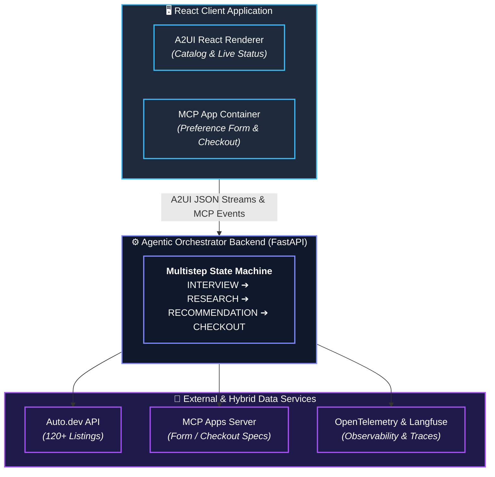

# MatchMyDrive — AI Car Matchmaker

[](https://match-my-drive.vercel.app)
[](https://matchmydrive-backend.onrender.com/health)
[](#quick-start-docker-compose)
[](https://codespaces.new/Saquib504/MatchMyDrive)

**Amulate Summer Hackathon 2026** — A multistep AI agent that helps users find the right car to rent or buy, with protocol-based generative UI (A2UI) and embedded MCP Apps for forms and mock checkout.

## Architecture



## Features

- **Multistep Agent State Machine**: `INTERVIEW` → `RESEARCH` → `RECOMMENDATION` → `CHECKOUT`
- **A2UI Protocol**: Streaming declarative JSON for live progress steps and catalog grids
- **MCP Apps** (Mandatory per hackathon): Interactive preference form and safe mock checkout rendered in-chat
- **Mock Marketplace**: 200 cars across 10 categories × 10 brands (SQLite)
- **Trade-Off Matrix**: Compares top-rated vs best-value options
- **Observability**: OpenTelemetry-style logging + optional Langfuse integration
- **Multi-LLM Support**: Google Gemini (recommended, free tier), Anthropic Claude, or OpenAI GPT-4o-mini with **automatic fallback** between providers
- **Conversational AI**: Context-aware responses with conversation history (with graceful fallback to rule-based responses)
- **Real API Integration**: Auto.dev API for live car data with automatic fallback to mock data
- **Smart Image Matching**: Make/model-specific car images with category fallbacks
- **Enhanced Error Handling**: Comprehensive error messages and user feedback

## Quick Start (Docker Compose)

### Prerequisites

- Docker & Docker Compose
- LLM API Key (optional for conversational AI):
  - **Google Gemini** (recommended - free tier available): Get key at https://aistudio.google.com/app/apikey
  - Anthropic Claude (requires paid plan)
  - OpenAI GPT-4o-mini (requires credits)
- Auto.dev API Key (optional for real car data integration)

### Running the App

```bash
# 1. Clone and enter the project
cd ai-car-matchmaker

# 2. Configure environment variables
cp .env.example .env
# Edit .env and set your preferred LLM provider and API key:
# - For Gemini (recommended): LLM_PROVIDER=gemini, GEMINI_API_KEY=your_key
# - For Anthropic: LLM_PROVIDER=anthropic, ANTHROPIC_API_KEY=your_key
# - For OpenAI: LLM_PROVIDER=openai, OPENAI_API_KEY=your_key
#
# Note: You can configure multiple API keys simultaneously. The system will
# automatically fallback to other providers if your preferred one fails (quota,
# errors, etc.). If no LLM is available, the system uses intelligent rule-based
# responses.

# 3. Build and launch containers
docker-compose up --build
```

Open **http://localhost:3000** for the frontend and **http://localhost:8000/health** for the backend health check.

### Local Development (without Docker)

**Backend:**
```bash
cd backend
python -m venv venv && source venv/bin/activate
pip install -r requirements.txt
uvicorn app.main:app --reload --port 8000
```

**Frontend:**
```bash
cd frontend
npm install
npm run dev
```

## Project Structure

```
ai-car-matchmaker/
├── .cursorrules              # Cursor development guidelines
├── backend/
│   ├── app/
│   │   ├── agent.py          # Multistep agent & state machine
│   │   ├── database.py       # SQLite 120+ car dataset
│   │   ├── main.py           # FastAPI server & /api/chat
│   │   ├── mcp_apps.py       # MCP App schemas (form & checkout)
│   │   └── observability.py  # Langfuse + OTEL tracing
│   ├── Dockerfile
│   └── requirements.txt
├── frontend/
│   ├── src/
│   │   ├── App.jsx           # Main UI with A2UI & MCP renderers
│   │   ├── main.jsx
│   │   └── index.css
│   ├── Dockerfile
│   └── package.json
├── docker-compose.yml
├── .env.example
└── README.md
```

## Hackathon Submission Checklist

### Mandatory Requirements
- [x] Multistep Agent Harness with explicit state machine
- [x] **MCP Apps (Mandatory)**: Preference form + mock checkout in-chat
- [x] A2UI Protocol: Dynamic progress tracker + catalog grid
- [x] 100+ Listing Mock Marketplace (200 cars, 10 categories, 10 brands)
- [x] Full AI Observability hooks (Langfuse + OpenTelemetry logging)
- [x] Containerized Delivery via Docker Compose
- [x] README with setup instructions
- [x] Multi-LLM Integration (Gemini, Anthropic, OpenAI) with automatic fallback and graceful degradation
- [x] Real API Integration with Auto.dev (hybrid approach)
- [x] Enhanced error handling and user feedback
- [x] Smart image matching for car listings

### Optional Features (Implemented)
- [x] Marketplace API integration (Auto.dev) - Used regular API as allowed per requirements

## API Endpoints

| Method | Path | Description |
|--------|------|-------------|
| POST | `/api/chat` | Send message/form data to agent |
| GET | `/health` | Health check |
| DELETE | `/api/session/{id}` | Reset agent session |

## LLM Configuration

The AI Car Matchmaker supports multiple LLM providers for conversational AI responses with **automatic fallback**:

### Automatic Fallback Behavior
- Configure **multiple API keys** simultaneously for maximum reliability
- System tries your preferred provider first (set via `LLM_PROVIDER`)
- If the preferred provider fails (quota limit, errors, etc.), it automatically tries other available providers
- Order of fallback: Preferred → Anthropic → OpenAI → Gemini
- If all LLM providers fail, the system uses intelligent **rule-based responses**
- User experience remains seamless regardless of LLM availability

### Google Gemini (Recommended for Hackathons)
- **Free tier available** - perfect for hackathon projects
- Get your API key at: https://aistudio.google.com/app/apikey
- Set in `.env`:
  ```
  LLM_PROVIDER=gemini
  GEMINI_API_KEY=your_gemini_api_key_here
  ```

### Anthropic Claude
- Requires paid plan
- Set in `.env`:
  ```
  LLM_PROVIDER=anthropic
  ANTHROPIC_API_KEY=your_anthropic_api_key_here
  ```

### OpenAI GPT-4o-mini
- Requires credits
- Set in `.env`:
  ```
  LLM_PROVIDER=openai
  OPENAI_API_KEY=your_openai_api_key_here
  ```

### Example: Multiple Providers for Redundancy
```bash
# Configure all three for maximum reliability
LLM_PROVIDER=gemini  # Try Gemini first
GEMINI_API_KEY=your_gemini_key
ANTHROPIC_API_KEY=your_anthropic_key  # Fallback to Anthropic
OPENAI_API_KEY=your_openai_key  # Fallback to OpenAI
```

**Note**: The system works perfectly without any LLM API key using enhanced rule-based responses. LLM integration is optional and provides more natural, context-aware conversations.

## Demo Video

A complete demo video script is available at [DEMO_VIDEO_SCRIPT_FINAL.md](DEMO_VIDEO_SCRIPT_FINAL.md).

**Script covers:**
- Introduction to the application
- Opening the AI assistant with MCP Preference Form
- Form submission and research phase
- Viewing car details with trade-off matrix
- Mock checkout with MCP Checkout App
- Natural language chat interaction
- Category filtering (API vs database)
- Technical details and observability

**Duration:** 4-5 minutes

**Recording checklist:** [DEMO_RECORDING_CHECKLIST.md](DEMO_RECORDING_CHECKLIST.md)

## License

MIT — Built for Amulate Summer Hackathon 2026.
